## Desarrollo de la actividad 2 de la asignatura de CC3S2

1. **Primero preparamos preparamos el entorno de desarrollo esto con la función `prepare` del script.

    * Visualizamos contenido de directorio, el cual muestra solo el script, ademas podemos ver que no tiene permisos de ejecución.

      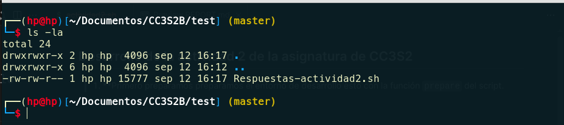

    * Damos permisos de ejecución con `chmod +x Respuestas-actividad2.sh`, al listar nuevamente, veremos que el archivo cambia de color y tiene los permisos de ejecución para todos los usuarios (-rwx el x indica que el archivo se puede ejecutar)

      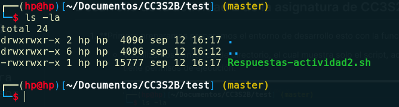

    * Preparamos el entorno de desarrollo con `./Respuestas-actividad2.sh prepare`, esto generara algunas carpetas necesaria, ademas de crear el archivo `miapp/app.py` el cual ya tendrá implementado un servicio web de nuestro app, ademas de generar un entorno virtual de python `.venv`

      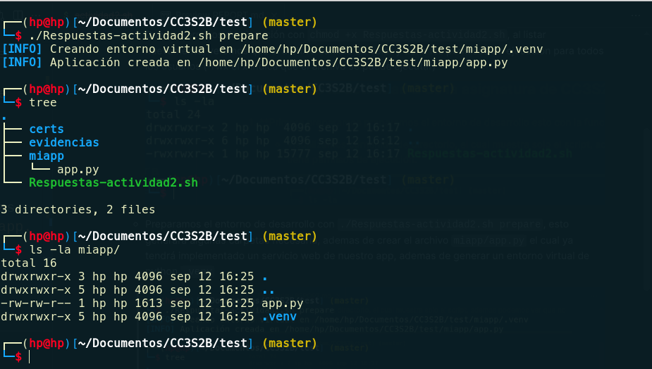

    * Ejecutamos la aplicación con `./Respuestas-actividad2.sh run`, esto levantara la aplicación en nuestro local y esta disponible para su acceso.

      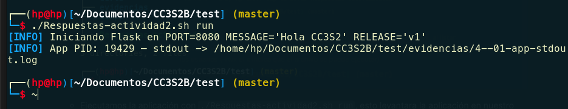

    * Lo anterior guardo el log de la ejecución de la aplicación en un archivo dentro de la carpeta `evidencias` la cual mostramos a continuación.

      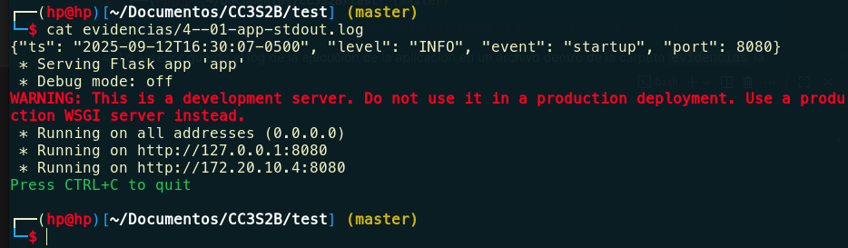

    * También podemos acceder desde el navegador a dicho servicio web, ya que estamos seguros que el servicio web ya esta ejecutándose,

      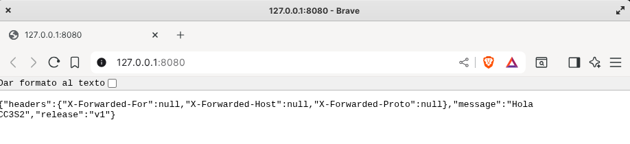

    * Generalmente accedemos a una pagina web mediante un dominio, por ejemplo `miapp.local`, como por el momento no lo tenemos configurado, esto nos generara un error.

      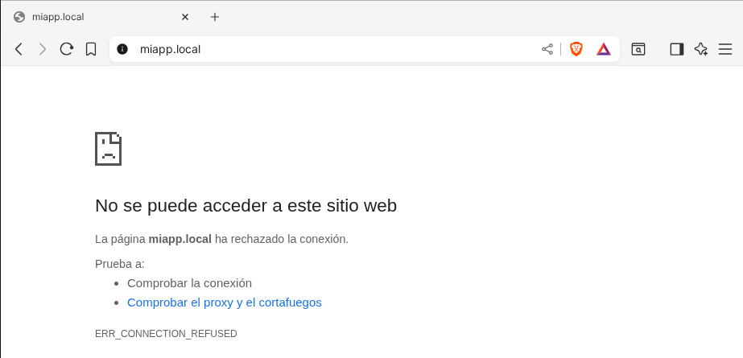

    * Añadimos el dominio `miapp.local` para poder ser accedido mediante este, para ello, primero ejecutamos el script con `./Respuestas-actividad2.sh hosts-setup`, esto configurando el dominio a nuestro host.

      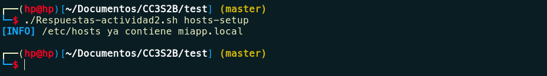

    * Ahora que ya tengo mi ip asociado a mi dominio, hacemos un demo con el DNS que se resuelva correctamente.

      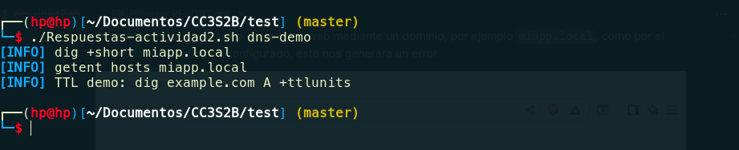

    * Configuramos un certificado con el comando `./Respuestas-actividad2.sh tls-cert`, esto generara los certificados en la carpeta `certs`.

      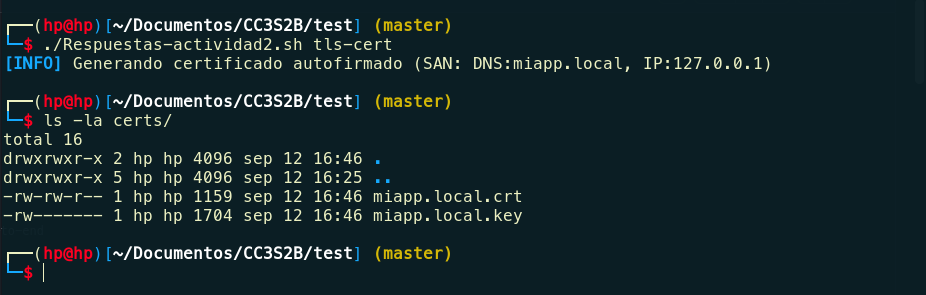

    * Configuramos Nginx.

      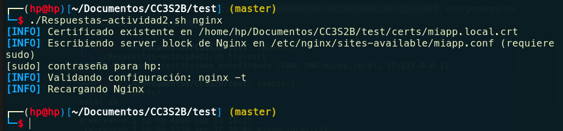

    * Con los pasos anteriores ya listos, ahora podemos acceder a la aplicación web mediante el dominio `miapp.local`.

      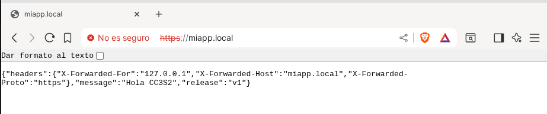

    * Realizamos alguna pruebas de tls.

      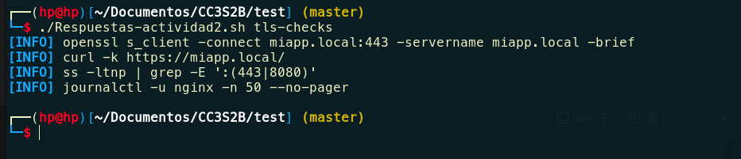

    * Cada paso que se realizo, fueron registrando los logs en la carpeta evidencias.

      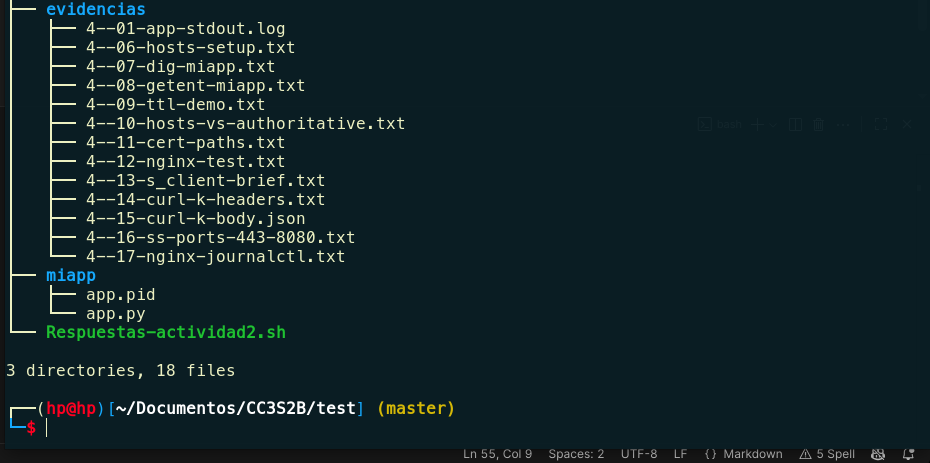